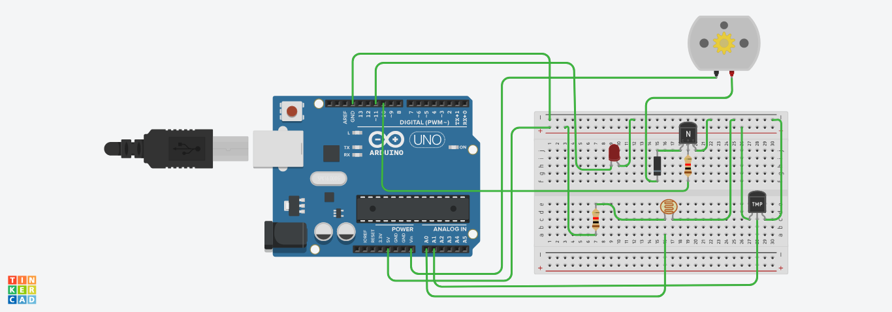
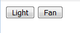

# Home-Automation
Fan and Light controlled by sensors using Arduino and Wifi module

# Description
An automated light and fan system built using Arduino which is controlled
via static web page. The lighting system depends on surrounding light
intensity and the speed of fan varies according to the surrounding
temperature.

For my project I used LED for light and DC Motor for Fan.

# Components Used
* Arduino Uno
* ESP8266-01 board flashed with AT firmware
* Temperature Sensor
* Photoresistor
* 1N4001 diode
* 2 Resistors
* PN2222 Transistor
* LED

#Circuit Diagram:

All connections except Wifi module:

ESP8266 connections

# Steps

1. After making all the connections, open the home_automation.ino file in Arduino IDE
2. Select Arduino board,connect via USB and upload the sketch.
3. Open the home.html

4. Select the button to turn on the device.
5. You can turn any on device off by pressing the same button again.
